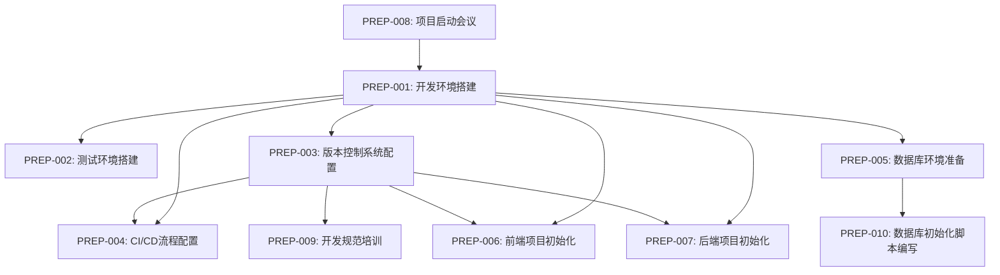

# 行政办公任务中心系统 - 项目任务跟踪

*文档编号：PROJ-001*  
*版本：v1.0*  
*更新日期：2024-03-31*  
*关联文档：[实施计划](../design/IMPLEMENTATION_PLAN.md)*

## 目录

- [1. 项目概述](#1-项目概述)
- [2. 任务跟踪流程](#2-任务跟踪流程)
- [3. 项目阶段总览](#3-项目阶段总览)
- [4. 准备阶段任务](#4-准备阶段任务)
- [5. 开发阶段任务](#5-开发阶段任务)
- [6. 测试阶段任务](#6-测试阶段任务)
- [7. 部署阶段任务](#7-部署阶段任务)
- [8. 验收阶段任务](#8-验收阶段任务)
- [9. 风险与问题跟踪](#9-风险与问题跟踪)
- [10. 里程碑检查点](#10-里程碑检查点)

## 1. 项目概述

本文档用于跟踪行政办公任务中心系统项目各阶段的任务完成情况，明确每个任务的负责人、截止日期、当前状态以及相关参考文档，确保项目按照计划顺利进行。

### 1.1 文档使用说明

- 项目经理负责维护和更新本文档
- 每周例会前更新任务状态
- 各任务负责人需及时反馈任务进展
- 任务状态分为：未开始、进行中、已完成、已延期、已取消
- 重要里程碑达成需记录在里程碑检查点章节

## 2. 任务跟踪流程

### 2.1 任务分解规范

#### 2.1.1 任务层级结构
1. **项目阶段**：根据项目阶段总览划分的主要阶段
2. **阶段任务**：每个阶段下的主要任务
3. **执行步骤**：任务的具体执行步骤
4. **最小可执行任务**：在 `tasks/` 目录下的详细任务分解

#### 2.1.2 最小可执行任务规范
每个最小可执行任务必须包含以下信息：
- 任务ID：唯一标识符
- 任务名称：简短描述
- 优先级：P0（最高）到P3（最低）
- 需求等级：核心/重要/可选
- 产品影响：高/中/低
- 执行步骤
- 检查点
- 相关文件
- 状态跟踪

#### 2.1.3 代码开发任务规范
代码开发类任务必须遵循以下步骤：
1. 需求分析
   - 分析任务需求
   - 确认需求边界
   - 识别潜在风险

2. 代码复用分析
   - 检查现有代码库
   - 评估可复用组件
   - 确定复用策略

3. 技术栈评估
   - 确认是否在现有技术栈范围内
   - 评估是否需要引入新技术
   - 评估技术风险

4. 测试规范
   - 单元测试：每个最小可执行任务必须包含
   - 集成测试：子任务完成时必须执行
   - 测试用例：必须覆盖主要场景

5. 文档更新
   - 更新相关技术文档
   - 更新API文档
   - 更新测试文档

6. 代码提交
   - 遵循代码提交规范
   - 提供清晰的提交信息
   - 确保代码审查通过

### 2.2 任务创建与分配

1. 项目经理根据实施计划创建任务
2. 在团队例会中分配任务并确认时间点
3. 在本文档中记录任务信息
4. 为每个执行步骤创建最小可执行任务文档

### 2.3 任务状态更新

1. 任务负责人每周汇报任务进展
2. 项目经理更新任务状态
3. 对已延期任务进行特别标记并制定补救措施
4. 更新最小可执行任务的状态

### 2.4 任务完成确认

1. 任务负责人提交任务成果
2. 相关审核人员确认任务完成质量
3. 项目经理更新任务状态为"已完成"
4. 确保所有最小可执行任务都已完成并记录

### 2.5 最小可执行任务文档模板

```markdown
# 最小可执行任务文档

*任务ID：TASK-XXX*  
*所属任务：PARENT-TASK-XXX*  
*优先级：P0/P1/P2/P3*  
*需求等级：核心/重要/可选*  
*产品影响：高/中/低*  
*状态：未开始/进行中/已完成/已延期*  
*负责人：XXX*  
*开始日期：YYYY-MM-DD*  
*结束日期：YYYY-MM-DD*

## 任务描述
[详细描述任务内容和目标]

## 执行步骤
1. [步骤1]
   - [ ] 子步骤1.1
   - [ ] 子步骤1.2
   ...

2. [步骤2]
   - [ ] 子步骤2.1
   - [ ] 子步骤2.2
   ...

## 检查点
- [ ] 检查点1
- [ ] 检查点2
...

## 相关文件
- 文件1：[路径] - [用途]
- 文件2：[路径] - [用途]
...

## 测试要求
### 单元测试
- [ ] 测试用例1
- [ ] 测试用例2
...

### 集成测试
- [ ] 测试场景1
- [ ] 测试场景2
...

## 文档更新
- [ ] 文档1：[更新内容]
- [ ] 文档2：[更新内容]
...

## 状态记录
| 日期 | 状态 | 更新内容 | 更新人 |
|------|------|---------|--------|
| YYYY-MM-DD | 开始 | 任务启动 | XXX |
| YYYY-MM-DD | 进行中 | 完成步骤1 | XXX |
| YYYY-MM-DD | 完成 | 任务完成 | XXX |

## 备注
[其他需要说明的内容]
```

## 3. 项目阶段总览

项目分为以下几个主要阶段，每个阶段包含多个子任务：

| 阶段 | 起始日期 | 结束日期 | 状态 | 负责人 | 参考文档 |
|------|---------|---------|------|-------|---------|
| 准备阶段 | 2024-04-01 | 2024-04-15 | 进行中 | 项目经理 | [实施计划](../design/IMPLEMENTATION_PLAN.md) |
| 开发阶段 | 2024-04-16 | 2024-07-15 | 未开始 | 技术经理 | [技术架构设计](../design/TECHNICAL_ARCHITECTURE.md) |
| 测试阶段 | 2024-07-16 | 2024-08-15 | 未开始 | 测试经理 | [测试计划](../testing/TEST_PLAN.md) |
| 部署阶段 | 2024-08-16 | 2024-08-31 | 未开始 | 运维经理 | [部署指南](../deployment/DEPLOYMENT_GUIDE.md) |
| 验收阶段 | 2024-09-01 | 2024-09-15 | 未开始 | 项目经理 | [需求规格说明书](../requirements/REQUIREMENTS_SPECIFICATION.md) |

## 4. 准备阶段任务

### 4.1 环境准备任务

| 任务ID | 任务名称 | 开始日期 | 结束日期 | 状态 | 负责人 | 依赖任务 | 参考文档 |
|--------|---------|---------|---------|------|-------|---------|---------|
| PREP-001 | 开发环境搭建 | 2024-04-01 | 2024-04-02 | 已完成 | 运维工程师 | 无 | [环境搭建说明](../deployment/ENVIRONMENT_SETUP.md) |

#### 执行步骤
1. 基础环境准备
   - [x] 安装Node.js v18.20.6
   - [x] 安装Git v2.43.0
   - [x] 安装Docker v26.1.3
   - [x] 安装MySQL v8.0.41
   - [x] 配置SSH密钥

2. 开发工具配置
   - [x] 配置Git用户信息
   - [x] 配置SSH密钥
   - [x] 配置pnpm包管理器
   - [x] 配置国能镜像加速

3. 项目环境配置
   - [x] 克隆项目代码仓库
   - [x] 配置MySQL服务
   - [x] 配置环境变量
   - [x] 安装项目依赖
   - [x] 初始化数据库

#### 检查点
- [x] 基础软件安装完成
  - Node.js v18.20.6
  - Git v2.43.0
  - Docker v26.1.3
  - MySQL v8.0.41
- [x] 开发工具配置完成
  - Git用户信息已配置
  - SSH密钥已配置
  - pnpm v10.6.5已配置
  - 国能镜像已配置
- [x] 项目代码仓库已克隆
- [x] MySQL服务配置完成
  - 数据库taskshub_dev已创建
  - 用户taskshub_user已创建并授权
- [x] 环境变量配置完成
  - 创建.env文件
  - 配置数据库连接信息
  - 配置应用基本参数
- [x] 项目依赖安装完成
  - 使用pnpm安装依赖
  - 配置.npmrc文件
  - 配置.cursorignore文件
- [x] 数据库初始化完成
  - 创建Prisma schema
  - 配置数据库连接
  - 执行数据库迁移
  - 生成Prisma客户端

#### 相关文档
- [环境搭建说明](../deployment/ENVIRONMENT_SETUP.md)
- [技术架构设计](../design/TECHNICAL_ARCHITECTURE.md)

### 4.2 项目初始化任务

| 任务ID | 任务名称 | 开始日期 | 结束日期 | 状态 | 负责人 | 依赖任务 | 参考文档 |
|--------|---------|---------|---------|------|-------|---------|---------|
| PREP-002 | 测试环境搭建 | 2024-04-04 | 2024-04-06 | 未开始 | 运维工程师 | PREP-001 | [环境搭建说明](../deployment/ENVIRONMENT_SETUP.md) |
| PREP-003 | 版本控制系统配置 | 2024-04-01 | 2024-04-02 | 已完成 | 技术经理 | PREP-001 | [技术架构设计](../design/TECHNICAL_ARCHITECTURE.md) |
| PREP-004 | CI/CD流程配置 | 2024-04-03 | 2024-04-05 | 已完成 | 技术经理 | PREP-001, PREP-003 | [技术架构设计](../design/TECHNICAL_ARCHITECTURE.md) |
| PREP-005 | 数据库环境准备 | 2024-04-04 | 2024-04-06 | 未开始 | 数据库工程师 | PREP-001 | [数据库设计](../design/DATABASE_DESIGN.md) |
| PREP-006 | 前端项目初始化 | 2024-04-08 | 2024-04-10 | 未开始 | 前端负责人 | PREP-001, PREP-003 | [前端开发指南](../development/FRONTEND_GUIDE.md) |
| PREP-007 | 后端项目初始化 | 2024-04-08 | 2024-04-10 | 未开始 | 后端负责人 | PREP-001, PREP-003 | [后端开发指南](../development/BACKEND_GUIDE.md) |
| PREP-008 | 项目启动会议 | 2024-04-01 | 2024-04-01 | 已完成 | 项目经理 | 无 | [实施计划](../design/IMPLEMENTATION_PLAN.md) |
| PREP-009 | 开发规范培训 | 2024-04-09 | 2024-04-09 | 未开始 | 技术经理 | PREP-003 | [编码规范](../development/CODING_STANDARDS.md) |
| PREP-010 | 数据库初始化脚本编写 | 2024-04-11 | 2024-04-13 | 未开始 | 数据库工程师 | PREP-005 | [数据库设计](../design/DATABASE_DESIGN.md) |

### 4.3 任务依赖关系图



### 4.4 当前进度

#### 已完成任务
- PREP-001：开发环境搭建（2024-04-02完成）
- PREP-008：项目启动会议（2024-04-01完成）
- PREP-004：CI/CD流程配置（2024-04-05完成）
- PREP-003：版本控制系统配置（2024-04-05完成）

#### 进行中任务
- 无

#### 待开始任务
- PREP-002：测试环境搭建
- PREP-005：数据库环境准备
- PREP-006：前端项目初始化
- PREP-007：后端项目初始化
- PREP-009：开发规范培训
- PREP-010：数据库初始化脚本编写

## 5. 开发阶段任务

### 5.1 迭代一：用户认证与基础框架（2024-04-16至2024-05-15）

| 任务ID | 任务名称 | 开始日期 | 结束日期 | 状态 | 负责人 | 参考文档 |
|--------|---------|---------|---------|------|-------|---------|
| DEV-001 | 前端基础框架搭建 | 2024-04-16 | 2024-04-22 | 未开始 | 前端开发团队 | [前端开发指南](../development/FRONTEND_GUIDE.md) |

#### 执行步骤
1. 项目初始化
   - [ ] 创建React项目
   - [ ] 配置TypeScript
   - [ ] 配置ESLint和Prettier
   - [ ] 配置构建工具

2. 依赖安装
   - [ ] 安装Ant Design
   - [ ] 安装路由库
   - [ ] 安装状态管理库
   - [ ] 安装HTTP客户端

3. 基础架构搭建
   - [ ] 配置路由结构
   - [ ] 实现布局组件
   - [ ] 配置全局样式
   - [ ] 实现基础组件

4. 开发环境配置
   - [ ] 配置开发服务器
   - [ ] 配置热重载
   - [ ] 配置代理服务器
   - [ ] 配置环境变量

#### 检查点
- [ ] 项目可以正常启动和构建
- [ ] 代码规范检查通过
- [ ] 基础组件可以正常使用
- [ ] 路由系统正常工作
- [ ] 开发环境配置正确

#### 相关文档
- [前端开发指南](../development/FRONTEND_GUIDE.md)
- [UI设计](../design/UI_DESIGN.md)
- [编码规范](../development/CODING_STANDARDS.md)

### 5.2 迭代二：用户与部门管理（2024-05-16至2024-06-15）

| 任务ID | 任务名称 | 开始日期 | 结束日期 | 状态 | 负责人 | 参考文档 |
|--------|---------|---------|---------|------|-------|---------|
| DEV-007 | 用户管理后端实现 | 2024-05-16 | 2024-05-25 | 未开始 | 后端开发团队 | [API设计](../design/API_DESIGN.md) |
| DEV-008 | 用户管理前端实现 | 2024-05-16 | 2024-05-25 | 未开始 | 前端开发团队 | [UI设计](../design/UI_DESIGN.md) |
| DEV-009 | 部门管理后端实现 | 2024-05-26 | 2024-06-04 | 未开始 | 后端开发团队 | [API设计](../design/API_DESIGN.md) |
| DEV-010 | 部门管理前端实现 | 2024-05-26 | 2024-06-04 | 未开始 | 前端开发团队 | [UI设计](../design/UI_DESIGN.md) |
| DEV-011 | 集成测试 | 2024-06-05 | 2024-06-10 | 未开始 | 测试团队 | [测试用例](../testing/TEST_CASES.md) |
| DEV-012 | 问题修复 | 2024-06-11 | 2024-06-15 | 未开始 | 开发团队 | - |

### 5.3 迭代三：任务管理（2024-06-16至2024-07-15）

| 任务ID | 任务名称 | 开始日期 | 结束日期 | 状态 | 负责人 | 参考文档 |
|--------|---------|---------|---------|------|-------|---------|
| DEV-013 | 任务创建与分配功能后端 | 2024-06-16 | 2024-06-25 | 未开始 | 后端开发团队 | [API设计](../design/API_DESIGN.md) |
| DEV-014 | 任务创建与分配功能前端 | 2024-06-16 | 2024-06-25 | 未开始 | 前端开发团队 | [UI设计](../design/UI_DESIGN.md) |
| DEV-015 | 任务跟踪与更新功能后端 | 2024-06-26 | 2024-07-05 | 未开始 | 后端开发团队 | [API设计](../design/API_DESIGN.md) |
| DEV-016 | 任务跟踪与更新功能前端 | 2024-06-26 | 2024-07-05 | 未开始 | 前端开发团队 | [UI设计](../design/UI_DESIGN.md) |
| DEV-017 | 多级子任务功能实现 | 2024-07-06 | 2024-07-10 | 未开始 | 开发团队 | [需求规格说明书](../requirements/REQUIREMENTS_SPECIFICATION.md) |
| DEV-018 | 集成测试与问题修复 | 2024-07-11 | 2024-07-15 | 未开始 | 开发团队 | [测试用例](../testing/TEST_CASES.md) |

## 6. 测试阶段任务

### 6.1 功能测试（2024-07-16至2024-07-31）

| 任务ID | 任务名称 | 开始日期 | 结束日期 | 状态 | 负责人 | 参考文档 |
|--------|---------|---------|---------|------|-------|---------|
| TEST-001 | 测试环境准备与数据初始化 | 2024-07-16 | 2024-07-18 | 未开始 | 测试团队 | [环境搭建说明](../deployment/ENVIRONMENT_SETUP.md) |

#### 执行步骤
1. 测试环境搭建
   - [ ] 准备测试服务器
   - [ ] 部署测试版本
   - [ ] 配置测试数据库
   - [ ] 配置测试工具

2. 测试数据准备
   - [ ] 创建测试用户数据
   - [ ] 创建测试任务数据
   - [ ] 创建测试部门数据
   - [ ] 准备测试用例数据

3. 测试工具配置
   - [ ] 配置自动化测试框架
   - [ ] 配置测试报告工具
   - [ ] 配置问题跟踪工具
   - [ ] 配置性能测试工具

#### 检查点
- [ ] 测试环境可以正常访问
- [ ] 测试数据准备完整
- [ ] 测试工具配置正确
- [ ] 自动化测试可以运行
- [ ] 测试报告可以生成

#### 相关文档
- [测试计划](../testing/TEST_PLAN.md)
- [测试用例](../testing/TEST_CASES.md)
- [环境搭建说明](../deployment/ENVIRONMENT_SETUP.md)

### 6.2 非功能测试（2024-08-01至2024-08-15）

| 任务ID | 任务名称 | 开始日期 | 结束日期 | 状态 | 负责人 | 参考文档 |
|--------|---------|---------|---------|------|-------|---------|
| TEST-006 | 性能测试 | 2024-08-01 | 2024-08-05 | 未开始 | 测试团队 | [测试计划](../testing/TEST_PLAN.md) |
| TEST-007 | 安全测试 | 2024-08-06 | 2024-08-10 | 未开始 | 安全专家 | [安全设计](../design/SECURITY_DESIGN.md) |
| TEST-008 | 兼容性测试 | 2024-08-11 | 2024-08-13 | 未开始 | 测试团队 | [测试计划](../testing/TEST_PLAN.md) |
| TEST-009 | 非功能测试报告编写 | 2024-08-14 | 2024-08-15 | 未开始 | 测试经理 | - |

## 7. 部署阶段任务

### 7.1 预生产环境部署（2024-08-16至2024-08-23）

| 任务ID | 任务名称 | 开始日期 | 结束日期 | 状态 | 负责人 | 参考文档 |
|--------|---------|---------|---------|------|-------|---------|
| DEPL-001 | 预生产环境准备 | 2024-08-16 | 2024-08-17 | 未开始 | 运维团队 | [环境搭建说明](../deployment/ENVIRONMENT_SETUP.md) |
| DEPL-002 | 数据库部署 | 2024-08-18 | 2024-08-19 | 未开始 | 数据库工程师 | [部署指南](../deployment/DEPLOYMENT_GUIDE.md) |
| DEPL-003 | 后端服务部署 | 2024-08-20 | 2024-08-21 | 未开始 | 运维团队 | [部署指南](../deployment/DEPLOYMENT_GUIDE.md) |
| DEPL-004 | 前端应用部署 | 2024-08-22 | 2024-08-22 | 未开始 | 运维团队 | [部署指南](../deployment/DEPLOYMENT_GUIDE.md) |
| DEPL-005 | 部署验证 | 2024-08-23 | 2024-08-23 | 未开始 | 测试团队 | [部署指南](../deployment/DEPLOYMENT_GUIDE.md) |

### 7.2 生产环境部署（2024-08-24至2024-08-31）

| 任务ID | 任务名称 | 开始日期 | 结束日期 | 状态 | 负责人 | 参考文档 |
|--------|---------|---------|---------|------|-------|---------|
| DEPL-006 | 生产环境准备 | 2024-08-24 | 2024-08-25 | 未开始 | 运维团队 | [环境搭建说明](../deployment/ENVIRONMENT_SETUP.md) |
| DEPL-007 | 数据库部署 | 2024-08-26 | 2024-08-27 | 未开始 | 数据库工程师 | [部署指南](../deployment/DEPLOYMENT_GUIDE.md) |
| DEPL-008 | 后端服务部署 | 2024-08-28 | 2024-08-29 | 未开始 | 运维团队 | [部署指南](../deployment/DEPLOYMENT_GUIDE.md) |
| DEPL-009 | 前端应用部署 | 2024-08-30 | 2024-08-30 | 未开始 | 运维团队 | [部署指南](../deployment/DEPLOYMENT_GUIDE.md) |
| DEPL-010 | 部署验证 | 2024-08-31 | 2024-08-31 | 未开始 | 测试团队 | [部署指南](../deployment/DEPLOYMENT_GUIDE.md) |

## 8. 验收阶段任务

### 8.1 用户验收测试（2024-09-01至2024-09-08）

| 任务ID | 任务名称 | 开始日期 | 结束日期 | 状态 | 负责人 | 参考文档 |
|--------|---------|---------|---------|------|-------|---------|
| UAT-001 | 用户验收测试计划制定 | 2024-09-01 | 2024-09-02 | 未开始 | 项目经理 | [需求规格说明书](../requirements/REQUIREMENTS_SPECIFICATION.md) |
| UAT-002 | 用户培训 | 2024-09-03 | 2024-09-04 | 未开始 | 培训讲师 | [培训计划](../training/TRAINING_PLAN.md) |
| UAT-003 | 用户验收测试执行 | 2024-09-05 | 2024-09-07 | 未开始 | 最终用户 | [用户操作手册](../user/USER_MANUAL.md) |
| UAT-004 | 问题收集与分析 | 2024-09-08 | 2024-09-08 | 未开始 | 项目经理 | - |

### 8.2 项目收尾（2024-09-09至2024-09-15）

| 任务ID | 任务名称 | 开始日期 | 结束日期 | 状态 | 负责人 | 参考文档 |
|--------|---------|---------|---------|------|-------|---------|
| CLOSE-001 | 问题修复与系统调整 | 2024-09-09 | 2024-09-12 | 未开始 | 开发团队 | - |
| CLOSE-002 | 项目文档归档 | 2024-09-13 | 2024-09-14 | 未开始 | 项目经理 | [实施计划](../design/IMPLEMENTATION_PLAN.md) |
| CLOSE-003 | 项目总结会议 | 2024-09-15 | 2024-09-15 | 未开始 | 项目经理 | [实施计划](../design/IMPLEMENTATION_PLAN.md) |

## 9. 风险与问题跟踪

| 风险/问题ID | 描述 | 影响程度 | 状态 | 负责人 | 缓解措施 | 截止日期 |
|------------|-----|---------|------|-------|---------|---------|
| RISK-001 | CI/CD流程配置可能影响现有开发流程 | 高 | 已解决 | 技术经理 | 1. 制定详细的迁移计划<br>2. 分阶段实施<br>3. 提供培训和支持<br>4. 设置回滚机制 | 2024-04-05 |
| RISK-002 | 安全扫描可能发现大量漏洞需要修复 | 中 | 已解决 | 技术经理 | 1. 设置合理的扫描阈值<br>2. 建立漏洞修复优先级<br>3. 制定修复计划<br>4. 定期评估进展 | 2024-04-05 |
| RISK-003 | 自动化测试覆盖率不足 | 中 | 已解决 | 技术经理 | 1. 设置最低覆盖率要求<br>2. 添加关键测试用例<br>3. 定期审查测试质量<br>4. 持续改进测试策略 | 2024-04-05 |
| RISK-004 | 部署回滚机制可能影响服务可用性 | 高 | 已解决 | 技术经理 | 1. 设计零停机回滚方案<br>2. 进行回滚演练<br>3. 监控回滚过程<br>4. 建立应急预案 | 2024-04-05 |

## 10. 里程碑检查点

| 里程碑ID | 描述 | 计划日期 | 实际日期 | 状态 | 备注 |
|---------|-----|---------|---------|------|------|
| MS-001 | 项目启动 | 2024-04-01 | 2024-04-01 | 已达成 | 项目启动会议已完成 |
| MS-002 | 开发环境准备完成 | 2024-04-15 | 2024-04-02 | 已达成 | 提前完成开发环境搭建 |
| MS-003 | CI/CD流程配置完成 | 2024-04-05 | 2024-04-05 | 已达成 | 按计划完成CI/CD配置 |
| MS-004 | 用户认证功能完成 | 2024-05-15 | - | 未达成 | - |
| MS-005 | 用户与部门管理完成 | 2024-06-15 | - | 未达成 | - |
| MS-006 | 任务管理功能完成 | 2024-07-15 | - | 未达成 | - |
| MS-007 | 测试阶段完成 | 2024-08-15 | - | 未达成 | - |
| MS-008 | 系统部署完成 | 2024-08-31 | - | 未达成 | - |
| MS-009 | 用户验收完成 | 2024-09-08 | - | 未达成 | - |
| MS-010 | 项目结束 | 2024-09-15 | - | 未达成 | - |

---

*文档结束* 